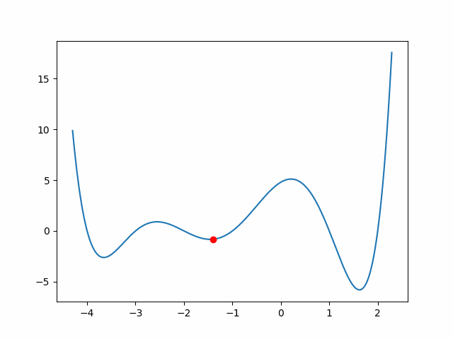

## Simulated Anealing pytorch
This is an pytorch Optimizer() using Simulating Annealing Algorithm to find the target solution.

```linux
# Code Structure
.
├── LICENSE
├── Readme.md
├── Simulated_Annealing_Optimizer.py  # SimulatedAnealling(optim.Optimizer)
├── demo.py                           # Demo using Simulated Annealing to solve a question
└── fig 
    └── test_animation.gif
```
We can use:
```python3
from Simulated_Annealing_Optimizer import SimulatedAnealling
```
to import the optimizer.
And we can initialize the optimizer by
```python3
self.optimizer=SimulatedAnealling(params=model.parameters(),init_temp=args.init_temp,cooling=args.cooling
                                          ,lr=args.lr,model=self.model,loss_fn=self.loss_fn,y=self.y)
```
### Algorithm
The procedure of the algorithm can be described as follow：
### Demo
demo.py provides a little demo describes how optimizer could be used.

